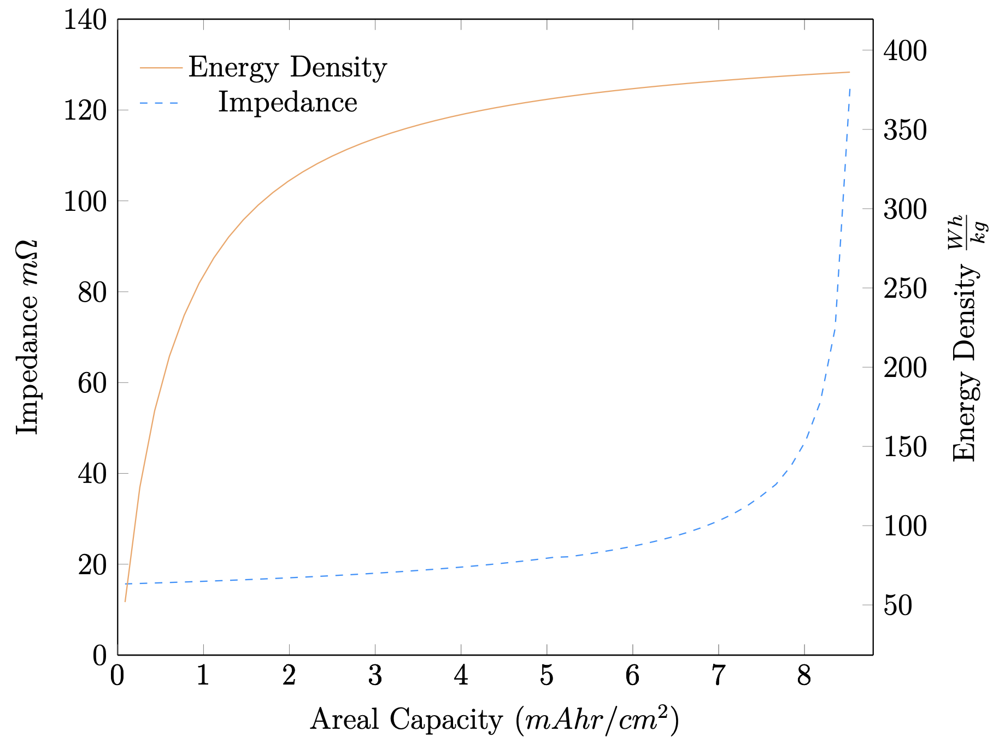

# BattCalc.jl

[](https://github.com/BradyPlanden/BattCalc.jl/actions)
[](https://github.com/invenia/BlueStyle)
[](https://github.com/SciML/ColPrac)

BattCalc.jl is a battery prediction tool useful for initial battery design predictions. Investigate differing battery configurations with this simplistic electrochemical calculator. This tool is aimed towards fast configurations, and high-level trend analysis. This shouldn't be used as a ground-truth prediction tool, submit a feature request if you have ideas on how to improve this tool. This package is under development, so please report any bugs found. Finally, if you use this package please cite the repository.

<!-- Installation -->
### :gear: Installation (Julia 1.7 and later)
-----------------------------

```julia
(v1.7) pkg> add https://github.com/BradyPlanden/BattCalc.jl
```

(Type `]` to enter package mode.)


<!-- Getting Started -->
## 	:toolbox: Getting Started
Add packages to your REPL:
```julia
using BattCalc, Measurements, Unitful, Plots
```

Create data structure containing initial electrochemical parameters, and define the number of stacks per cell.
```julia
Pack = PackStruct(Cell=Params(Neg=Anode(),
                              Pos=Cathode(),
                              Sep=Separator()))
```

Construct pouch cell data structure by passing electrode definitions and molecular composition, specific capacity calculation method, and lithium storage mechanism combined with the number of stacks per cell:
```julia
Pouch!(Pack.Cell,
       "NCM811",
       "Graphite",
       "1Li:0.8Ni:0.1Co:0.1Mn:2O",
       "1.0Li6.0C", 
       "Exper", 
       "Intercalation", 
       Stacks=10)
```
Finally, produce the full pack with the corresponding cells in series (100) and parallel (2) and apply a power load to the generated system:

```julia
MultiCell(Pack,100,2,40u"kW")
```
<!-- Screenshots -->
### :camera: Example Plots
Impedance and energy density response to areal capacity achieved by varied electrode porosities:
<p align="center">

</p>


